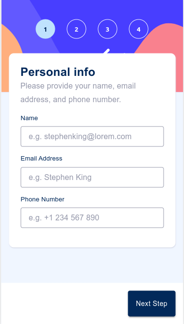
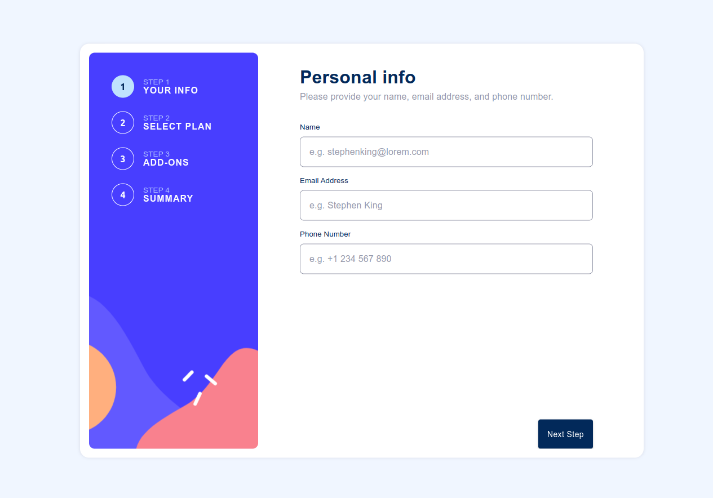

# Frontend Mentor - Multi-step form solution

This is a solution to the [Multi-step form challenge on Frontend Mentor](https://www.frontendmentor.io/challenges/multistep-form-YVAnSdqQBJ). Frontend Mentor challenges help you improve your coding skills by building realistic projects.

## Table of contents

- [Overview](#overview)
  - [The challenge](#the-challenge)
  - [Screenshot](#screenshot)
  - [Links](#links)
- [My process](#my-process)
  - [Built with](#built-with)

## Overview

### The challenge

Users should be able to:

- [x] Complete each step of the sequence
- [x] See a summary of their selections on the final step and confirm their order
- [x] View the optimal layout for the interface depending on their device's screen size
- [x] See hover and focus states for all interactive elements on the page

### Screenshot

| Mobile layout                                                 | Desktop layout                                                        |
| ------------------------------------------------------------- | --------------------------------------------------------------------- |
|  |  |

### Links

- Deploy [Multi-step form](https://your-live-site-url.com)

## My process

### Built with

- Flexbox
- SCSS
- [React](https://reactjs.org/) - JS library
- [Mui](https://mui.com/) - Material UI library
- [Yup](https://www.npmjs.com/package/yup) - JS Form validation library
